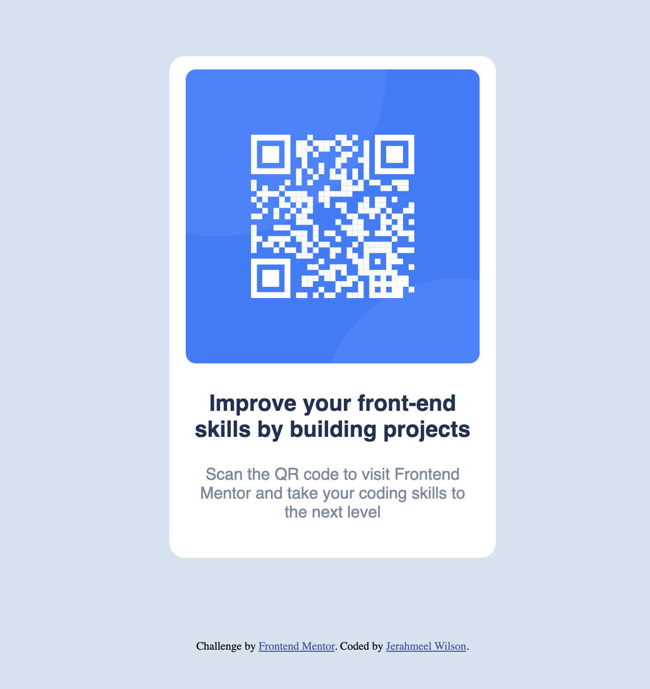

# Frontend Mentor - QR code component solution

This is a solution to the [QR code component challenge on Frontend Mentor](https://www.frontendmentor.io/challenges/qr-code-component-iux_sIO_H). Frontend Mentor challenges help you improve your coding skills by building realistic projects. 

## Table of contents

- [Overview](#overview)
  - [Screenshot](#screenshot)
  - [Links](#links)
- [My process](#my-process)
  - [Built with](#built-with)
  - [Useful resources](#useful-resources)
- [Author](#author)

## Overview

### Screenshot

### Links
- Live Site URL: [Add live site URL here](https://your-live-site-url.com)

## My process

I used a mobile first approach to implement this design after I noticed it should look the same on desktop and mobile devices. From there, everything else was straightforward. The most difficult parts were getting the spacing correct and getting the font sizes and font weights to match. 

### Built with

- Semantic HTML5 markup
- CSS custom properties
- Mobile-first workflow

### What I learned

Use this section to recap over some of your major learnings while working through this project. Writing these out and providing code samples of areas you want to highlight is a great way to reinforce your own knowledge.

### Continued development

In the future I am focusing on continuing to improve my skills in HTML, CSS, Javascript/React. In addition, I plan to incorporate Bootstrap and other CSS libaries into my projects. 

## Author

- Frontend Mentor - [@yourusername](https://www.frontendmentor.io/profile/jerahmeelwilson)

